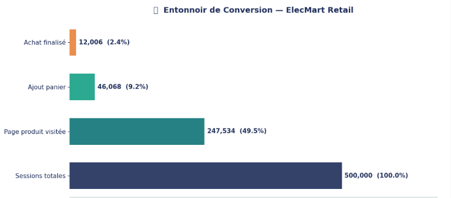
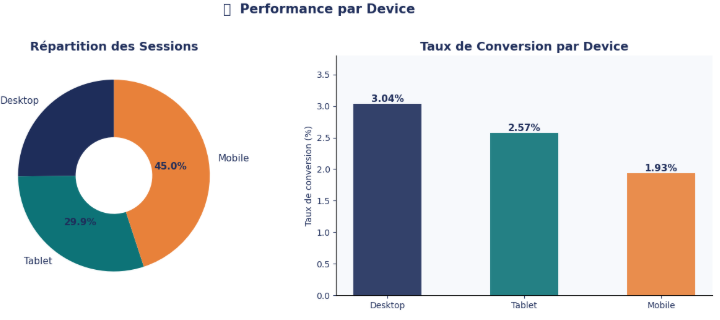
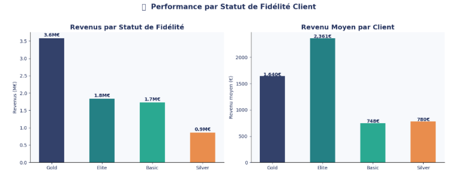
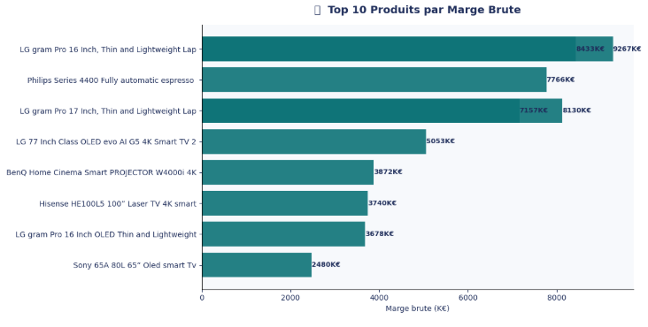

# 🛒 Analyse des Performances E-commerce — ElecMart Retail

> Projet portfolio Data Analyst · Secteur Retail & E-commerce · 2024






---

## 🎯 Problématique

**Comment optimiser les performances d'un e-commerce retail en analysant le comportement des visiteurs, les sources de trafic et la rentabilité produit ?**

---

## 📊 KPIs Clés

| KPI | Valeur |
|-----|--------|
| 🔍 Sessions analysées | 500 000 |
| 🛒 Taux de conversion | 2.40% |
| 🧺 Taux d'ajout panier | 9.21% |
| ❌ Taux d'abandon panier | 74% |
| 💰 Chiffre d'affaires total | 884M€ |
| 📈 Marge brute totale | 165M€ |
| 💹 Taux de marge | 18.7% |

---

## 💡 Insights Clés

- **74% des paniers abandonnés** → relance email automatique J+1 = levier prioritaire
- **Desktop convertit 57% mieux que Mobile** (3.04% vs 1.93%) malgré Mobile dominant (45% du trafic) → optimisation UX mobile urgente
- **LG gram Pro = produit le plus rentable** (8 433K€ de marge) → à mettre en avant en homepage
- **Elite dépense 3x plus par client** que Basic/Silver (2 361€ vs ~750€) → programme de montée en gamme à développer
- **Gold génère le plus gros volume** de revenus (3.6M€) → segment prioritaire à fidéliser

---

## 🔍 Analyses réalisées

| Analyse | Insight clé |
|---------|-------------|
| 🛒 Entonnoir de conversion | 49.5% visitent une page produit, seulement 2.4% achètent |
| 📱 Performance par device | Desktop 3.04% vs Mobile 1.93% — écart de 57% |
| 🔗 Sources de trafic | Campaign = meilleur taux de conversion, Organic = 1er en volume |
| ⏰ Sessions par heure | Identification des pics pour cibler les campagnes marketing |
| 📅 Revenus mensuels | Évolution revenus & marge brute sur 2 ans (2022-2024) |
| 👥 Fidélité clients | Elite génère 3x plus par client que Basic/Silver |
| 🏆 Top produits | LG gram Pro domine avec 8 433K€ de marge brute |
| 🔥 Segment × Canal | Croisement segment produit & canal d'acquisition |

---

## 💡 Recommandations Actionnables

| # | Recommandation | Impact estimé |
|---|---------------|---------------|
| 1 | **Optimiser l'UX mobile** — A/B test checkout | +30% conversion mobile |
| 2 | **Relance panier abandonné** — email J+1 promo 5% | -20% abandon panier |
| 3 | **Augmenter budget campagnes** — meilleur ROI | +15% conversions |
| 4 | **Programme fidélité Elite** — avantages exclusifs | +25% LTV clients |
| 5 | **Mettre en avant LG gram Pro** — homepage + push | +10% marge brute |

---

## 🗄️ Dataset

**Source :** [Kaggle — ECommerce Retail Analytics Dataset (ElecMart)](https://www.kaggle.com/datasets/ajibsss/elecmart-retail-analytics-dataset)

**Architecture en étoile — 14 tables · 1.8M+ lignes**

| Fichier | Disponible | Description |
|---------|-----------|-------------|
| `fact_clickstream.csv` | ⬇️ Kaggle | 1.7M sessions web |
| `fact_sale.csv` | ⬇️ Kaggle | 1.8M transactions |
| `dim_customer.csv` | ✅ repo | 150K clients |
| `dim_product.csv` | ✅ repo | 470 produits |

> ⚠️ Les fichiers `fact_` dépassent 100MB — à télécharger sur [Kaggle](https://www.kaggle.com/datasets/ajibsss/elecmart-retail-analytics-dataset) et placer dans le même dossier que le notebook.

---

## 🛠️ Stack technique

- **Python 3** · Pandas · Matplotlib · Seaborn
- **Jupyter Notebook** — analyse interactive
- **Kaggle** — source de données publique réelle
- **GitHub** — versioning et présentation portfolio

---

## 🚀 Lancer le projet

```bash
git clone https://github.com/thierrylaguerre/ecommerce-retail-analytics
cd ecommerce-retail-analytics
pip install -r requirements.txt
jupyter notebook analyse_ecommerce_elecmart.ipynb
```

---

## 👤 Auteur

**Thierry Laguerre** · Candidat Data Analyst Junior · Paris Île-de-France

Master Big Data — Paris 8 · Licence Informatique — Sorbonne Paris Nord

[](https://www.linkedin.com/in/thierry-laguerre-ba1267257/)
[](https://github.com/thierrylaguerre)
[](mailto:thierrylaguerre81@gmail.com)
